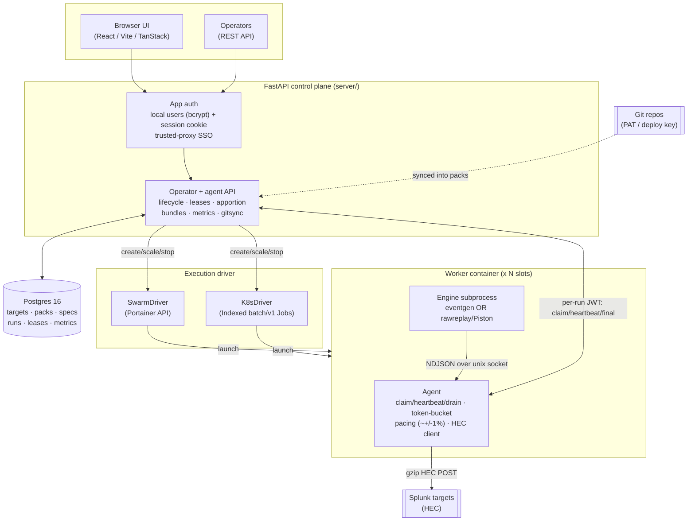

# Stoker

Stoker is a web UI and control plane for orchestrating fleets of Splunk HEC data generators. You configure a job (a sample pack, a target, a rate and a worker count) in the UI or over the API, press start, and Stoker launches disposable worker containers on Docker Swarm or Kubernetes that stream events over HEC to Splunk at an exact aggregate rate. Two worker engines ship: **eventgen** templates fresh events from samples, and **Piston** replays a recorded dataset byte-for-byte (the `splunk/security_content` attack_data use case).

Status: **shipped and running.** The worker image, the FastAPI + SQLAlchemy control plane, the React UI, both execution drivers (Swarm via Portainer and Kubernetes Indexed Jobs) with EKS Terraform, app-level auth and git pack sync are all live. See [Live deployment](#live-deployment).

## Architecture



The control plane never generates load itself. It owns state in Postgres (the source of truth), mints a per-run JWT, and drives a pluggable **ExecutionDriver** to launch worker containers. Each worker is an **agent** plus an **engine subprocess**: the engine only produces events and hands each one to the agent over a local unix socket (NDJSON); the agent owns metadata stamping, the pacing token bucket, HEC delivery and the whole control-plane conversation. Commands (release at T0, retarget, drain) ride heartbeat responses (push, not poll).

## Features

- **Two worker engines.** `eventgen` (vendored `splunk/eventgen` 7.2.1) templates events from samples. `rawreplay` / **Piston** replays a recorded dataset byte-for-byte, re-stamped to now, either at a chosen rate (dataset loops) or at the recorded cadence. `STOKER_ENGINE` selects; default `eventgen`.
- **Exact-rate pacing.** A token bucket paces delivery against the wall clock to within ~+/-1% of the target aggregate rate, sharded across N workers by largest-remainder. Modes: EPS, GB/day, or count/interval.
- **Two execution drivers.** SwarmDriver (Docker Swarm via the Portainer API, never mounting docker.sock) and K8sDriver (Kubernetes elastic Indexed `batch/v1` Jobs, k3s or EKS). A FakeDriver backs the tests. EKS Terraform under `infra/aws/stoker-eks/`.
- **App-level auth.** Local password users (bcrypt) with a signed HttpOnly session cookie, roles `viewer < operator < admin`, a default admin seeded from env or a first-visit setup screen, user management, and trusted-proxy-header SSO (a header honoured only from a trusted peer). Vendor-neutral: no dependency on any specific IdP. `/api/agent` (per-run JWT) and `/api/hooks` (webhook HMAC) are exempt.
- **Packs from git.** Register a git repo (HTTPS PAT or SSH deploy key); Stoker clones it, indexes pack roots, lints them and resyncs on a GitHub push webhook (per-repo HMAC). A local pack directory can also be registered directly.
- **Replay is single-worker.** A rawreplay run is forced to one worker (a multi-worker replay spec is rejected `409 replay_single_worker` at submit, and pinned at provision and scale).
- **Dogfood telemetry.** The control plane can stream its own run metrics to a HEC target for self-observability (off unless configured).

## Quick starts

### Worker, standalone (no control plane)

Run a single worker against Splunk directly. The `eventgen` engine templating the bundled `flatline` pack at 100 EPS for 120 s:

```bash
docker run --rm \
  -e STOKER_STANDALONE=1 \
  -e STOKER_BUNDLE=/packs/flatline \
  -e STOKER_HEC_URL=http://splunk:8088 \
  -e STOKER_HEC_TOKEN=<token> \
  -e STOKER_INDEX=loadtest \
  -e STOKER_RATE_MODE=eps -e STOKER_RATE_VALUE=100 \
  -e STOKER_DURATION_S=120 \
  -v "$(pwd)/packs:/packs:ro" \
  ghcr.io/livehybrid/stoker-worker:latest
```

Piston raw-replay instead: point at the `attack-replay` pack and select the `rawreplay` engine. In rate mode the recorded dataset loops and is re-stamped to now, delivered at the token-bucket rate:

```bash
docker run --rm \
  -e STOKER_STANDALONE=1 \
  -e STOKER_ENGINE=rawreplay \
  -e STOKER_BUNDLE=/packs/attack-replay \
  -e STOKER_HEC_URL=http://splunk:8088 \
  -e STOKER_HEC_TOKEN=<token> \
  -e STOKER_INDEX=main \
  -e STOKER_RATE_MODE=eps -e STOKER_RATE_VALUE=50 \
  -e STOKER_DURATION_S=120 \
  -v "$(pwd)/packs:/packs:ro" \
  ghcr.io/livehybrid/stoker-worker:latest
```

See [docs/WORKER-CONTRACT.md](docs/WORKER-CONTRACT.md) for the full environment contract (managed and standalone modes), the socket protocol and the pacing mechanism.

### Control plane

Deploy the control plane (FastAPI + built UI + Postgres 16) as a Docker Swarm stack via the Portainer API:

```bash
cd infra/stacks/stoker
cp .env.example .env   # set STOKER_DB_PASSWORD, PORTAINER_HOST/TOKEN, PUBLIC_BASE_URL, admin/SSO
python deploy.py            # create or update the stack
python deploy.py --status   # show the stack + services
```

`deploy.py` creates the `stoker_master_key` swarm secret once (a Fernet key persisted in `.env` so encrypted data survives redeploys) and injects env from `.env`. Kubernetes manifests are under `infra/k8s/`; EKS Terraform under `infra/aws/stoker-eks/`.

## Live deployment

- UI + operator API: **https://stoker.cloud.livehybrid.com** (protected by app-level auth)
- LAN: **http://192.168.0.112:8091**
- Portainer swarm stack 107, Postgres 16 backing store.
- Images: `ghcr.io/livehybrid/stoker` (control plane) and `ghcr.io/livehybrid/stoker-worker` (worker), both multi-arch (amd64, arm64) and cosign-signed.

## Repo layout

```
worker/    agent (control-plane protocol, token-bucket pacing, HEC client)
           + engines: vendored eventgen 7.2.1 and rawreplay/Piston
server/    FastAPI control plane: routes (agent/operator/auth/users),
           lifecycle, drivers (swarm/k8s/fake), gitsync, bundles, crypto, models
ui/        React / Vite / TanStack Router single-page app (built into the image)
packs/     example packs: flatline + apigw (eventgen), attack-replay (Piston)
infra/     stacks/stoker (swarm stack + deploy.py), k8s/ manifests,
           aws/stoker-eks/ Terraform
docs/      WORKER-CONTRACT.md and design references
tools/     hec_sink test collector + smoke scripts
```

## Documentation

- [docs/WORKER-CONTRACT.md](docs/WORKER-CONTRACT.md) — the worker image's environment contract, socket protocol, pacing and drain behaviour.
- [server/CONTROL-PLANE.md](server/CONTROL-PLANE.md) — the control-plane data model, agent + operator API and run lifecycle.
- [packs/attack-replay/README.md](packs/attack-replay/README.md) — the pack format (eventgen and Piston) worked through a raw-replay pack. Git sync and pack linting are covered in [server/CONTROL-PLANE.md](server/CONTROL-PLANE.md).
- [infra/k8s/README.md](infra/k8s/README.md), [infra/aws/stoker-eks/README.md](infra/aws/stoker-eks/README.md) — Kubernetes and EKS deployment.

## Licence

Apache-2.0. Vendors [splunk/eventgen](https://github.com/splunk/eventgen) 7.2.1 (Apache-2.0); see `worker/engines/eventgen/VENDOR.md`.
