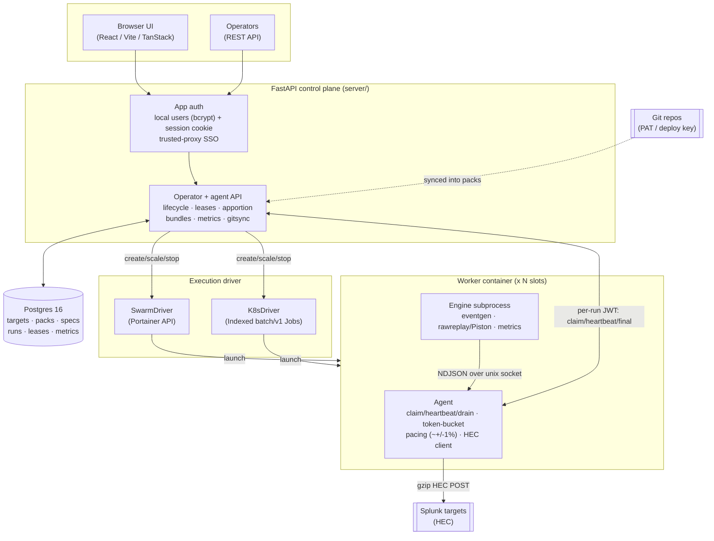

# Stoker

Stoker is a web UI and control plane for orchestrating fleets of Splunk HEC data generators. You configure a job (a sample pack, a target, a rate and a worker count) in the UI or over the API, press start, and Stoker launches disposable worker containers on Docker Swarm or Kubernetes that stream events over HEC to Splunk at an exact aggregate rate. Three worker engines ship: **eventgen** templates fresh events from samples, **Piston** replays a recorded dataset byte-for-byte (the `splunk/security_content` attack_data use case), and **metrics** generates synthetic Splunk metric data points over a shaped time series. Any run can optionally **backfill** the last N hours or days of history first.

Status: **shipped and running.** The worker image, the FastAPI + SQLAlchemy control plane, the React UI, both execution drivers (Swarm via Portainer and Kubernetes Indexed Jobs) with EKS Terraform, app-level auth and git pack sync are all live. See [Live deployment](#live-deployment).

## Architecture



The control plane never generates load itself. It owns state in Postgres (the source of truth), mints a per-run JWT, and drives a pluggable **ExecutionDriver** to launch worker containers. Each worker is an **agent** plus an **engine subprocess**: the engine only produces events and hands each one to the agent over a local unix socket (NDJSON); the agent owns metadata stamping, the pacing token bucket, HEC delivery and the whole control-plane conversation. Commands (release at T0, retarget, drain) ride heartbeat responses (push, not poll).

## Features

- **Three worker engines.** `eventgen` (vendored `splunk/eventgen` 7.2.1) templates events from samples. `rawreplay` / **Piston** replays a recorded dataset byte-for-byte, re-stamped to now, either at a chosen rate (dataset loops) or at the recorded cadence. `metrics` generates synthetic Splunk **metric** data points over a shaped time series. `STOKER_ENGINE` selects; default `eventgen`.
- **Metric builder.** Author a matrix of Splunk metrics (dimensions × metrics) with day-shaped values (sine, business double-hump, ramp, random-walk, …) in the UI, with a live daily-curve preview; `gauge` / `count` / `counter` kinds and per-cell scaling. Runs on the `metrics` engine, sharding the series matrix across workers. See [docs/PACKS.md](docs/PACKS.md#metric-packs-metricgen).
- **Exact-rate pacing.** A token bucket paces delivery against the wall clock to within ~+/-1% of the target aggregate rate, sharded across N workers by largest-remainder. Modes: EPS, GB/day, or count/interval.
- **Backfill.** Any run can prepend the last N hours or days of history: events are stamped at their historical time and delivered fast (up to a 5000-eps ceiling) before the run finishes. Metrics sweep the diurnal shape across the window; eventgen fills it at uniform density; the delivery rate honours the spec's own eps, clamped to the ceiling. Opt in per run in the wizard (with a live event/time/size estimate) or via `backfill_window_s` on the launch API.
- **Two execution drivers.** SwarmDriver (Docker Swarm via the Portainer API, never mounting docker.sock) and K8sDriver (Kubernetes elastic Indexed `batch/v1` Jobs, k3s or EKS). A FakeDriver backs the tests. EKS Terraform under `infra/aws/stoker-eks/`. The SwarmDriver pins each run's worker image to a registry digest, so a fleet always runs the intended build (a floating `:latest` that a node has cached is never silently reused).
- **App-level auth.** Local password users (bcrypt) with a signed HttpOnly session cookie, roles `viewer < operator < admin`, a default admin seeded from env or a first-visit setup screen, user management, and trusted-proxy-header SSO (a header honoured only from a trusted peer). Vendor-neutral: no dependency on any specific IdP. `/api/agent` (per-run JWT) and `/api/hooks` (webhook HMAC) are exempt.
- **API access for CI/CD + Swagger.** Admin-issued API tokens (`stk_...`, role-scoped, stored only as a SHA-256 hash, revocable, optional expiry) authenticate non-interactive callers via `Authorization: Bearer`, alongside the browser session. The whole REST API is documented as OpenAPI with **Swagger UI at `/docs`** (an Authorize box takes a token), so the spec drives client codegen.
- **Packs from git.** Register a git repo (HTTPS PAT or SSH deploy key); Stoker clones it, indexes pack roots, lints them and resyncs on a GitHub push webhook (per-repo HMAC). A local pack directory can also be registered directly.
- **Replay is single-worker.** A rawreplay run is forced to one worker (a multi-worker replay spec is rejected `409 replay_single_worker` at submit, and pinned at provision and scale).
- **Dogfood telemetry.** The control plane can stream its own run metrics to a HEC target for self-observability (off unless configured).

## Quick starts

### Worker, standalone (no control plane)

Run a single worker against Splunk directly. The `eventgen` engine templating the bundled `flatline` pack at 100 EPS for 120 s:

```bash
docker run --rm \
  -e STOKER_STANDALONE=1 \
  -e STOKER_BUNDLE=/packs/flatline \
  -e STOKER_HEC_URL=http://splunk:8088 \
  -e STOKER_HEC_TOKEN=<token> \
  -e STOKER_INDEX=loadtest \
  -e STOKER_RATE_MODE=eps -e STOKER_RATE_VALUE=100 \
  -e STOKER_DURATION_S=120 \
  -v "$(pwd)/packs:/packs:ro" \
  ghcr.io/livehybrid/stoker-worker:latest
```

Piston raw-replay instead: point at the `attack-replay` pack and select the `rawreplay` engine. In rate mode the recorded dataset loops and is re-stamped to now, delivered at the token-bucket rate:

```bash
docker run --rm \
  -e STOKER_STANDALONE=1 \
  -e STOKER_ENGINE=rawreplay \
  -e STOKER_BUNDLE=/packs/attack-replay \
  -e STOKER_HEC_URL=http://splunk:8088 \
  -e STOKER_HEC_TOKEN=<token> \
  -e STOKER_INDEX=main \
  -e STOKER_RATE_MODE=eps -e STOKER_RATE_VALUE=50 \
  -e STOKER_DURATION_S=120 \
  -v "$(pwd)/packs:/packs:ro" \
  ghcr.io/livehybrid/stoker-worker:latest
```

See [docs/WORKER-CONTRACT.md](docs/WORKER-CONTRACT.md) for the full environment contract (managed and standalone modes), the socket protocol and the pacing mechanism.

### Control plane

Deploy the control plane (FastAPI + built UI + Postgres 16) as a Docker Swarm stack via the Portainer API:

```bash
cd infra/stacks/stoker
cp .env.example .env   # set STOKER_DB_PASSWORD, PORTAINER_HOST/TOKEN, PUBLIC_BASE_URL, admin/SSO
python deploy.py            # create or update the stack
python deploy.py --status   # show the stack + services
```

`deploy.py` creates the `stoker_master_key` swarm secret once (a Fernet key persisted in `.env` so encrypted data survives redeploys) and injects env from `.env`. Kubernetes manifests are under `infra/k8s/`; EKS Terraform under `infra/aws/stoker-eks/`.

### API access (CI/CD) and Swagger

Every operator action is a REST call, so a pipeline can drive Stoker with an API token instead of a browser session. An admin mints a role-scoped token once (the secret is shown only on create), then it is presented as a bearer credential:

```bash
# Mint an operator token (needs an admin session or an admin token); secret shown once
curl -sX POST https://stoker.mydomain.com/api/tokens \
  -H "Authorization: Bearer $STOKER_ADMIN_TOKEN" -H 'Content-Type: application/json' \
  -d '{"name":"github-ci","role":"operator","expires_in_days":90}'

# Use it from CI to launch a run against an existing spec
curl -sX POST https://stoker.mydomain.com/api/specs/42/run \
  -H "Authorization: Bearer $STOKER_CI_TOKEN" -H 'Content-Type: application/json' -d '{}'
```

A token carries its own role (a CI token can be `operator` without holding admin), can be revoked (`DELETE /api/tokens/{id}`) or expired, and is attributed in the audit trail (`started_by = token:github-ci`). Interactive docs: **Swagger UI at `/docs`**, ReDoc at `/redoc`, spec at `/openapi.json` (the `bearerAuth` scheme drives the Authorize box and client codegen).

## Live deployment

- UI + operator API: **https://stoker.mydomain.com** (protected by app-level auth)
- LAN: **http://192.168.0.112:8091**
- Portainer swarm stack 107, Postgres 16 backing store.
- Images: `ghcr.io/livehybrid/stoker` (control plane) and `ghcr.io/livehybrid/stoker-worker` (worker), both multi-arch (amd64, arm64) and cosign-signed.

## Bundled packs

Stoker ships a set of ready-to-run packs under [`packs/`](packs/), each mapped to
its Splunk-native sourcetype so events land under the right field extractions.
Pick one at submit, set a rate (EPS or GB/day) and go; author your own with
[docs/PACKS.md](docs/PACKS.md).

| Pack | Engine | Sourcetype | What it generates |
|---|---|---|---|
| `flatline` | eventgen | `stoker:flatline` | Steady single-line web-service log at a constant rate — the exact-rate baseline. |
| `apigw` | eventgen | `stoker:apigw` | API gateway access log with a diurnal `hourOfDayRate` curve and a weighted status mix. |
| `web-access` | eventgen | `access_combined` | Generic website access log (NCSA combined): browsers, mobiles, API clients, search bots and scanner probes, diurnal curve. |
| `aws-cloudtrail` | eventgen | `aws:cloudtrail` | AWS CloudTrail JSON — S3 data events (GetObject/PutObject/DeleteObject/HeadObject/ListObjects) plus management events (ConsoleLogin, AssumeRole, RunInstances, CreateBucket, KMS). |
| `aws-s3-access` | eventgen | `aws:s3:accesslogs` | S3 server access logs — the space-delimited per-request log, weighted REST operation mix. |
| `aws-elb-alb` | eventgen | `aws:elb:accesslogs` | Application Load Balancer access logs — full ALB field order, weighted http/https/h2 and status mix. |
| `splunk-tutorial-web` | eventgen | `access_combined_wcookie` | Splunk Search Tutorial-style Buttercup Games web access log — product/category/cart actions with `productId`/`categoryId`/`JSESSIONID`. Synthetic reproduction of the tutorial format, not Splunk's copyrighted files. |
| `splunk-tutorial-secure` | eventgen | `linux_secure` | Splunk Search Tutorial-style secure.log — Linux sshd auth events (Failed/Accepted password, invalid user), brute-force heavy. |
| `splunk-tutorial-vendor-sales` | eventgen | `vendor_sales` | Splunk Search Tutorial-style vendor_sales.log — `VendorID`/`Code`/`AcctID` sales records (the tutorial's lookup dataset). |
| `attack-replay` | rawreplay (Piston) | `XmlWinEventLog` | Byte-for-byte replay of a recorded Sysmon/Windows-Security attack capture, re-stamped to now. |
| `web-store-metrics` | metrics | `stoker:metric` | Synthetic web-store KPIs as Splunk **metric** points (request/error counts, CPU, checkout latency) across service × region, with day-shaped patterns (a business double-hump, error spikes, a CPU sine). Deliver to a metrics-type index. |

All eventgen packs re-stamp timestamps to now, randomise source IPs and apply a
realistic weighted status/event mix. The `web-store-metrics` pack is a **metric**
pack (a `metricgen` block in `stoker.json`); author your own in the UI or as a
directory pack, and see [docs/PACKS.md](docs/PACKS.md#metric-packs-metricgen).
Want real recorded captures instead of synthetic templates? See
["Sourcing real datasets"](docs/PACKS.md#sourcing-real-datasets) for public
corpora (BOTSv3, attack_data, NASA-HTTP, …) you can wire in as `rawreplay`
`dataset_url` packs.

## Repo layout

```
worker/    agent (control-plane protocol, token-bucket pacing, HEC client)
           + engines: vendored eventgen 7.2.1 and rawreplay/Piston
server/    FastAPI control plane: routes (agent/operator/auth/users/tokens),
           lifecycle, drivers (swarm/k8s/fake), gitsync, bundles, crypto, models
ui/        React / Vite / TanStack Router single-page app (built into the image)
packs/     bundled packs (see "Bundled packs"): flatline, apigw, web-access,
           aws-cloudtrail, aws-s3-access, aws-elb-alb, splunk-tutorial-web,
           splunk-tutorial-secure, splunk-tutorial-vendor-sales (eventgen)
           + attack-replay (Piston) + web-store-metrics (metrics)
infra/     stacks/stoker (swarm stack + deploy.py), k8s/ manifests,
           aws/stoker-eks/ Terraform
docs/      WORKER-CONTRACT.md, PACKS.md and design references
harness/   integration harness: pytest that drives a live deployment over the
           API and asserts the indexed counts in Splunk
tools/     hec_sink test collector + smoke scripts
```

## Documentation

The full docs are published at **[livehybrid.github.io/stoker](https://livehybrid.github.io/stoker/)** (rendered from `docs/`).

- [docs/WORKER-CONTRACT.md](docs/WORKER-CONTRACT.md) — the worker image's environment contract, socket protocol, pacing, backfill and drain behaviour.
- [server/CONTROL-PLANE.md](server/CONTROL-PLANE.md) — the control-plane data model, agent + operator API (incl. API tokens + OpenAPI), auth and run lifecycle.
- [docs/PACKS.md](docs/PACKS.md) — the authoritative pack-format reference (eventgen, Piston and metric packs, `dataset_url` safety, git sync).
- [harness/README.md](harness/README.md) — the integration harness: minting an operator token, the env vars, and running the live end-to-end checks.
- [packs/attack-replay/README.md](packs/attack-replay/README.md) — the pack format worked through a real raw-replay pack.
- [infra/k8s/README.md](infra/k8s/README.md), [infra/aws/stoker-eks/README.md](infra/aws/stoker-eks/README.md) — Kubernetes and EKS deployment.

## Licence

Stoker is licensed under the **Apache License 2.0** — see [`LICENSE`](LICENSE) and the attribution [`NOTICE`](NOTICE).

It vendors [splunk/eventgen](https://github.com/splunk/eventgen) 7.2.1 (Apache-2.0; see `worker/engines/eventgen/VENDOR.md`) and redistributes third-party open-source dependencies in its container images. Those components, their versions and licences are inventoried in [`licenses/THIRD-PARTY-LICENSES.md`](licenses/THIRD-PARTY-LICENSES.md), with the full licence texts under [`licenses/`](licenses/).
