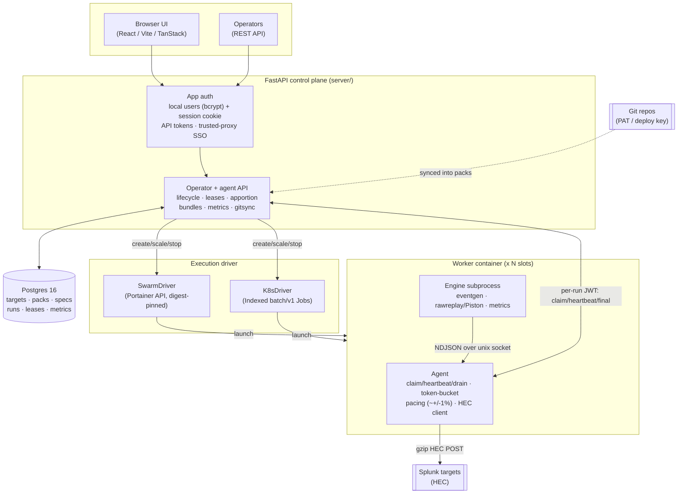

# Stoker

Stoker is a web UI and control plane for orchestrating fleets of Splunk HEC data
generators. You configure a job (a sample pack, a target, a rate and a worker
count) in the UI or over the API, press start, and Stoker launches disposable
worker containers on Docker Swarm or Kubernetes that stream events over HEC to
Splunk at an exact aggregate rate.

Three worker engines ship:

- **eventgen** templates fresh events from samples (vendored `splunk/eventgen`),
- **Piston** (`rawreplay`) replays a recorded dataset byte-for-byte, re-stamped to now,
- **metrics** generates synthetic Splunk metric data points over a shaped time series.

Any run can optionally **backfill** the last N hours or days of history first.

## Architecture

The control plane never generates load itself. It owns state in Postgres (the
source of truth), mints a per-run JWT, and drives a pluggable **ExecutionDriver**
to launch worker containers. Each worker is an **agent** plus an **engine
subprocess**: the engine only produces events and hands each one to the agent
over a local unix socket (NDJSON); the agent owns metadata stamping, the pacing
token bucket, HEC delivery and the whole control-plane conversation. Commands
(release at T0, retarget, drain) ride heartbeat responses (push, not poll).

## Documentation

- [Worker contract](WORKER-CONTRACT.md) — the worker image's environment
  contract, socket protocol, pacing, backfill and drain behaviour.
- [Control plane](control-plane.md) — the data model, agent + operator API
  (incl. API tokens and OpenAPI), auth and run lifecycle.
- [Packs](PACKS.md) — the authoritative pack-format reference (eventgen, Piston
  and metric packs, `dataset_url` safety, git sync).
- [Integration harness](harness.md) — a pytest suite that drives a live
  deployment over the API and asserts the indexed counts in Splunk.
- [Phase 0 review](PHASE0-REVIEW.md) — the adversarial review of the worker.

The full REST API is documented as OpenAPI: **Swagger UI at `/docs`**, ReDoc at
`/redoc`, spec at `/openapi.json`.

## Source

Stoker is open source (Apache-2.0) at
[github.com/livehybrid/stoker](https://github.com/livehybrid/stoker).
